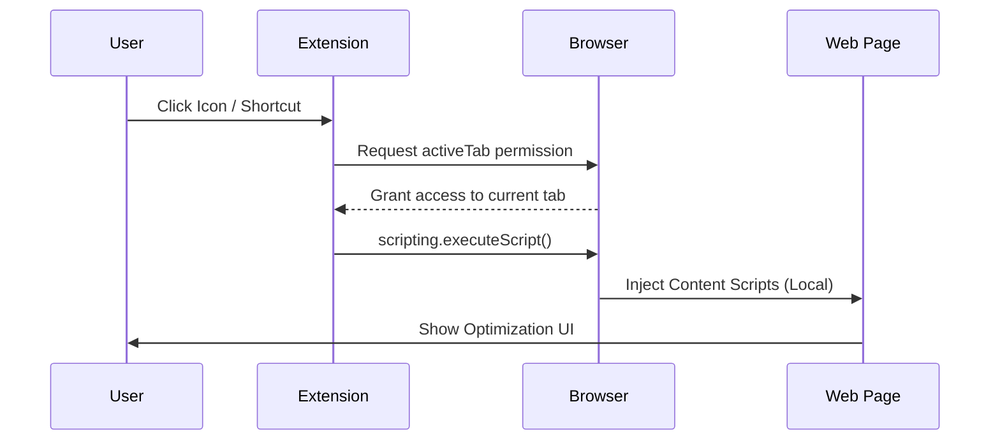
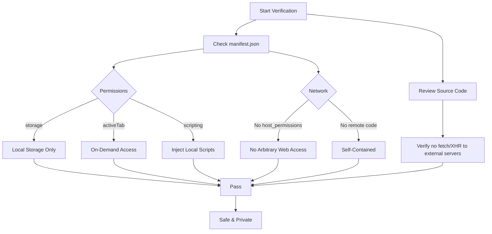

# Privacy Policy for PrompthaKCer

**Last Updated: December 2024**

## Overview

PrompthaKCer ("we", "our", or "the extension") is committed to protecting your privacy. This Privacy Policy explains how we handle information when you use our Chrome extension.

## Data Collection

**We do not collect any personal data.**

PrompthaKCer operates entirely locally within your browser. We do not:
- Collect, transmit, or store any personal information
- Send your prompts or data to external servers
- Use analytics or tracking services
- Share any information with third parties

## Data Storage

All data is stored locally on your device using Chrome's built-in storage APIs:

### What We Store Locally

1. **Settings and Preferences**
   - Extension enabled/disabled state
   - Compression level preference
   - Custom rules you create
   - Site configurations

2. **Prompt History** (optional)
   - Original and optimized prompts
   - Optimization statistics
   - Timestamps

3. **Statistics**
   - Total prompts optimized
   - Total tokens saved
   - Rule usage counts

### Data Control

You have full control over your data:
- **View**: Access all stored data in Settings > Data
- **Export**: Download your history as JSON
- **Delete**: Clear all history and statistics
- **Reset**: Reset all settings to defaults

## Permissions

PrompthaKCer requests the following permissions to function correctly. All operations are performed locally.

| Permission | Purpose |
|------------|---------|
| `storage` | Save your settings, history, and custom rules locally on your device. |
| `activeTab` | Detect if the current tab is a supported AI chat site when you click the extension icon. |
| `contextMenus` | Add "Optimize with PrompthaKCer" option to the right-click menu. |
| `clipboardWrite` | Allow the extension to copy optimized prompts to your clipboard. |
| `clipboardRead` | Allow pasting text from your clipboard into the extension for optimization. |
| `scripting` | Inject the optimization interface and logic into supported AI chat websites. |

### How Permissions Work

### Validation Process

You can verify that PrompthaKCer respects your privacy by reviewing the code and manifest.

## Third-Party Services

PrompthaKCer does not integrate with any third-party services. All functionality is self-contained within the extension.

## Data Security

Since all data remains on your local device:
- Your prompts are never transmitted over the internet
- No server-side storage means no risk of data breaches
- Uninstalling the extension removes all stored data

## Children's Privacy

PrompthaKCer does not knowingly collect information from children under 13. The extension is intended for general audiences.

## Changes to This Policy

We may update this Privacy Policy from time to time. Any changes will be posted on this page with an updated revision date.

## Open Source

PrompthaKCer is open source. You can review our code to verify our privacy practices at:
https://github.com/haKC-ai/prompthakcer

## Contact

If you have questions about this Privacy Policy, please contact us at:
- Email: cory@hakc.ai
- GitHub: https://github.com/haKC-ai/prompthakcer/issues

---

**Summary**: PrompthaKCer runs 100% locally in your browser. We don't collect, transmit, or have access to any of your data. Your prompts and settings stay on your device.
